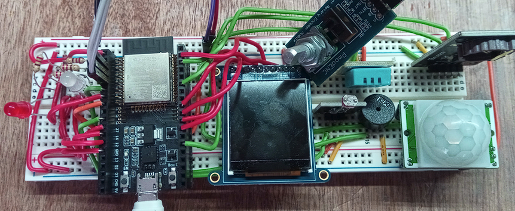
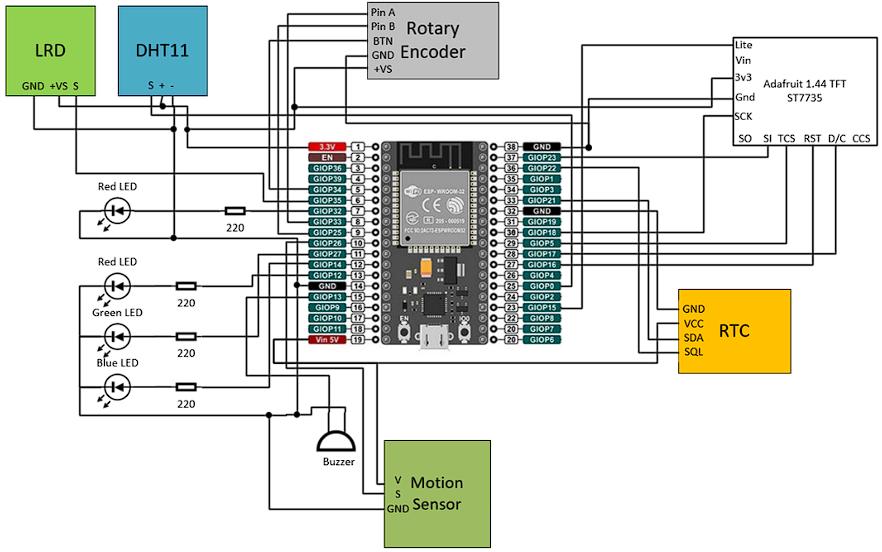
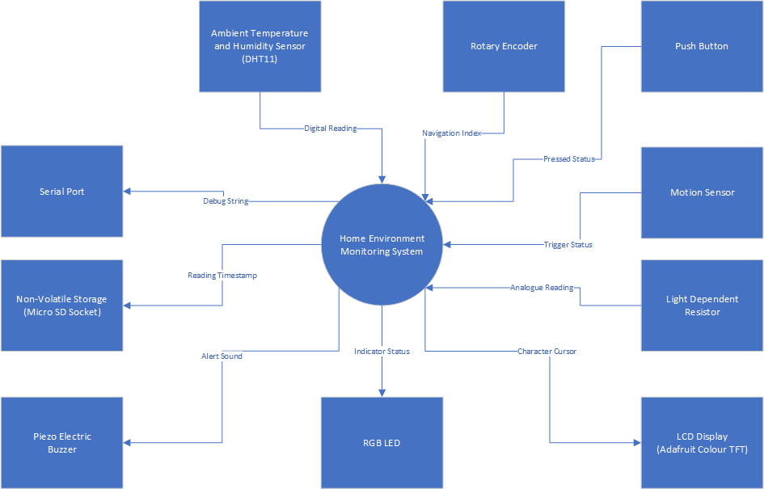
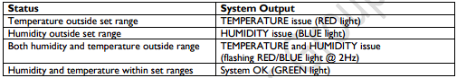

# Embedded Home Environment System
***University IoT/Embedded Systems group project to develop a home environment monitoring system using the ESP32, PlatformIO, and "baremetal" components.***

## ESP32 Pin Layout
- esp32doit-devkit-v1

## Baremental Componentry
- ***LED***, RBG values configured using Pulse Width Modulation.
- ***LDR***, including voltage divider.
- ***DHT11*** (Adafruit Unified Sensor).
- ***RotaryEncoder***, using pin interrupt.
- ***TFTDisplay*** (GFX Library and ST7735 Driver).
- ***SPIDisplay*** (TFT_eSPI) with double frame buffer implemented.
- ***RTC*** (Real Time Clock).
- ***SD*** (BusIO).

## Features
- Global and Screen configuration established as modules.
- Double Buffer method implemented to reduce flickering refreshes and data loss.
- Interrupt Routines established using FreeRTOS to ensure non-blocking task scheduling.
- Heartbeat and Self Test feature implemented to output RGB health status.

  
- Debounce method created to remove noise input from Rotary Encoder and Push Button components.
- Stack formatted to enable feature navigation through the menu.
- DHT11 module was implemented to obtain regular real-time data readings.
- Setting feature implemented to allow the user to adjust relevant values.
- RTC component added and formatted to maintain consistent date/time values for readings.
- Log module implemented to format reading records and manage SPI connections.
- WiFi formatted and set up.
